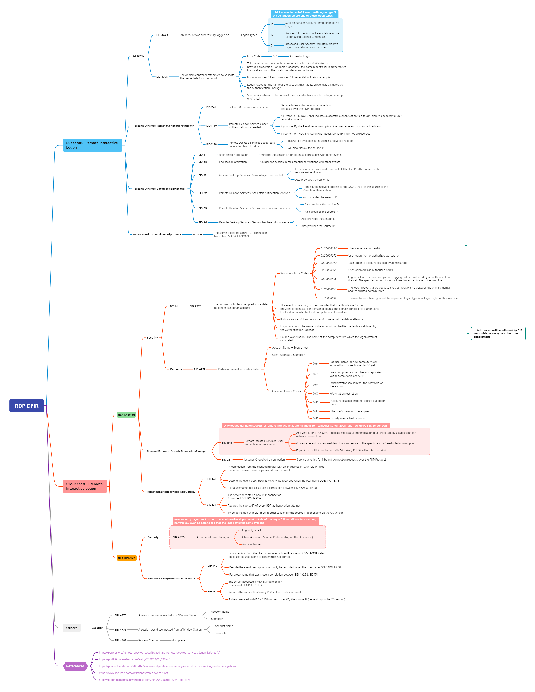

# RDP Athentication Artifacts Mind Map

This Mindmap represents different artifacts related to RDP authentication with NLA enabled or disabled to help collect and analyze forensic artifacts during DFIR engagements

## Editing/Improving this Mind Map

Import the `.xmind` file into your favorite Mind Map-making software! Improve upon it and do a Pull Request to update the file here!